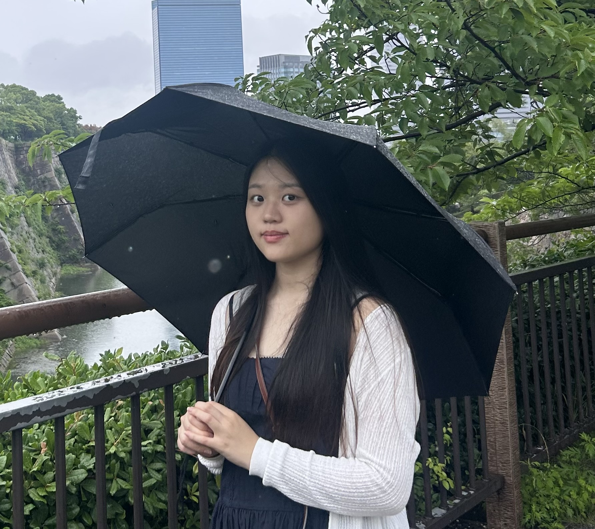

<div align="center">
  <h1>Sookmyung APPS Exhibition 2025</h1>
  <p><a href='https://github.com/APPS-sookmyung'>숙명여자대학교 소프트웨어학부 학회 APPS</a>   온라인 전시회</p>
   
</div>

<br />

## 🗂 목차

1. [**웹 서비스 소개**](#1)
2. [**기술 스택**](#2)
3. [**데모 영상**](#3)
4. [**개발 팀 소개**](#4)
5. [**개발 기간**](#5)
6. [**Git Convention**](#6)

<br />

<div id="1"></div>

## 💡 웹 서비스 소개

숙명여자대학교 소프트웨어학부 학회 <U>2025 APPS 전시회</U>에 오신 것을 환영합니다!</br>
아래 링크에서 부원들의 열정과 노력이 담긴 다양한 프로젝트들을 만나보세요.

[**🔗 배포된 웹 사이트 바로가기 Click !**](https://2025-apps-exhibition-webpage.vercel.app/) 👈 <br>
[**🔗 Linktree Click !**](https://linktr.ee/sookmyung_apps) 👈 <br>

> 새 창 열기 방법 : CTRL+click (on Windows and Linux) | CMD+click (on MacOS)

<br />

<div id="2"></div>

## 🛠 기술 스택

### **Front-end**

|  |  |  |  |  |
| :----------------------------------------------------------------------------------------------------------------------------: | :--------------------------------------------------------------------------------------------------------------------------: | :-------------------------------------------------------------------------------------------------------------------------------: | :-----------------------------------------------------------------------------------------------------------------------------: | :--------------------------------------------------------------------------------------------------------: |
|                                                              HTML                                                              |                                                             CSS                                                              |                                                               React                                                               |                                                         JavaScript(E26)                                                         |                                                Tailwind CSS                                                |

### **Back-end**

|  |
| :---------------------------------------------------------------------------------------------: |
|                                             Vercel                                              |

### **Version Control**

|  |  |
| :---------------------------------------------------------------------------------------------------------------: | :--------------------------------------------------------------------------------------------------------------------: |
|                                                        Git                                                        |                                                         Github                                                         |

<br />

<div id="3"></div>

## 🎥 데모 영상

|                             홈 화면                             |
| :-------------------------------------------------------------: |
|  |

|                             프로젝트 소개                              |
| :--------------------------------------------------------------------: |
|  |

|                             프로젝트 상세 페이지                              |
| :---------------------------------------------------------------------------: |
|  |

|                             활동 소개                              |
| :----------------------------------------------------------------: |
|  |

|                             APPS 소개                              |
| :----------------------------------------------------------------: |
|  |

<br />

<div id="4"></div>

## 💻 개발 팀 소개

|                                       이미지                                       |                                            이름 (전공)                                            |          역할           |                                                               개발 내용                                                               |
| :--------------------------------------------------------------------------------: | :-----------------------------------------------------------------------------------------------: | :---------------------: | :-----------------------------------------------------------------------------------------------------------------------------------: |
|   |     <a href="https://github.com/suminb99" target="_blank">백수민<br />(소프트웨어학부 22)</a>     |           PM            |                                                          온라인 전시회 기획                                                           |
|      |     <a href="https://github.com/JiiminHa" target="_blank">하지민<br />(소프트웨어학부 22)</a>     | FRONT-END</br> BACK-END | 프로젝트 상세 페이지 구현</br> 반응형 구현</br> 프로젝트 시연 영상 gif 변환 및 추가</br> 전체적인 반응형 점검 및 디자인 수정<br> 배포 |
|  |       <a href="http://rosaze.github.io" target="_blank">윤지원<br />(소프트웨어학부 23)</a>       | FRONT-END</br> BACK-END |                           프로젝트 상세 페이지 구현</br> 반응형 구현</br> 팀 프로젝트 데이터 추가<br> 배포                            |
|    |      <a href="https://github.com/uuzjin" target="_blank">임유진<br />(소프트웨어학부 24)</a>      |        FRONT-END        |                                       프로젝트 카드 캐러셀 구현</br> 프로젝트 카드 그리드 구현                                        |
|   | <a href="깃허브: https://github.com/tjsl0607" target="_blank">문예선<br />(소프트웨어학부 25)</a> |        FRONT-END        |                               APPS 소개 섹션 구현</br> 부원들이 말하는 APPS 섹션 구현</br> Footer 구현                                |
|     | <a href="깃허브: https://github.com/jimin-25" target="_blank">한지민<br />(소프트웨어학부 25)</a> |        FRONT-END        |                                  홈 화면 페이지 구현</br> APPS 활동 소개 섹션 구현</br> Header 구현                                   |

<br />

<div id="5"></div>

## 📅 개발 기간

2025년 11월 10일 ~ 12월 29일 (약 2개월)

<br>

<div id="6"></div>

## 📌 Git Convention

### 🔵 Commit Convention

- `feat` : 새로운 기능 추가
- `fix` : 버그, 오류 해결
- `build`: 빌드 시스템이나 외부 패키지 의존성에 변화를 준 경우
- `docs`: 문서 또는 주석만 바뀐 경우
- `perf`: **성능 향상**을 위한 코드 변경
- `refactor`: 버그 픽스나 새 기능 추가 또는 기존 기능 수정, 성능 향상 용도가 **아닌** 코드 변경 (기능 상의 변화가 없는 경우)
- `style`: UI 스타일 관련 변경
- `test`: 새 테스트 추가 또는 존재하는 테스트 수정
- `ci` : CI관련 설정 수정에 대한 커밋
- `chore` : 그 외 자잘한 수정에 대한 커밋

### 커밋 예시

```
<type>(<scope>): <subject>          -- 헤더
<BLANK LINE>
<body>                              -- 본문
```

ex)

```
fix: 시험 종료 기능 수정

[본문(선택 사항)]
```

<br>

### 🔵 Branch Convention

- `main` : 최종 배포 브랜치
- `feat` : 기능 단위 개발
- `fix` : 버그 및 오류 수정
- `style` : UI 스타일 관련 변경
- `docs` : 문서 및 주석 수정
- `chore` : 설정, 데이터 작업 등 기타 변경

### 브랜치 명 예시

- feat/기능 이름-이슈번호
  - ex) `feat/header-21`

<br>

### 🔵 Branch Strategy

- Git-flow 전략을 참고하여 브랜치 구조를 설계했습니다.
- 프로젝트 규모와 개발 인원을 고려하여 `main`과 `feat` 중심의 단순화된 브랜치 전략을 채택했습니다.
  - `main` 브랜치는 배포 단계에서만 사용하는 브랜치입니다.
  - `feat` 브랜치는 기능 단위로 분리하여 개발한 뒤,  
    작업 완료 후 `main` 브랜치에 병합하고 삭제하는 방식으로 관리했습니다.

<br>

### 🔵 Issue Convention

> Issue 타입은 커밋 컨벤션을 기준으로 하여 작업 성격을 명확히 구분했습니다.

- feat : 새로운 기능 추가
- fix : 버그, 오류 해결
- build: 빌드 시스템이나 외부 패키지 의존성에 변화를 준 경우
- docs: 문서 또는 주석만 바뀐 경우
- perf: **성능 향상**을 위한 코드 변경
- refactor: 버그 픽스나 새 기능 추가 또는 기존 기능 수정, 성능 향상 용도가 **아닌** 코드 변경 (기능 상의 변화가 없는 경우)
- style: UI 스타일 관련 변경
- test: 새 테스트 추가 또는 존재하는 테스트 수정
- ci : CI관련 설정 수정에 대한 커밋
- chore : 그 외 자잘한 수정에 대한 커밋

### 이슈 명 예시

- 이슈 항목: 개발 내용
  - ex) `feat: Header 구현`

<br>
